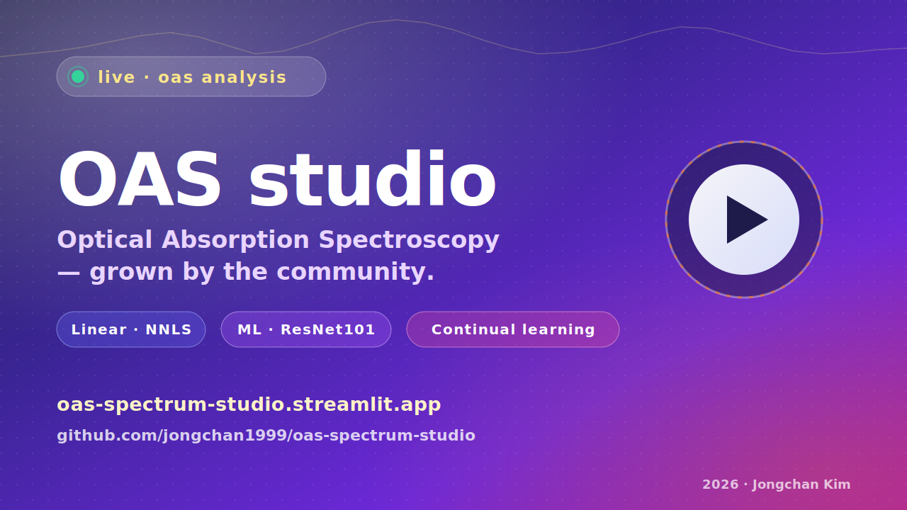

<div align="center">

  <a href="https://oas-spectrum-studio.streamlit.app">
    
  </a>

  <h1>OAS Spectrum Studio</h1>

  <p><strong>A single-screen analyser for Optical Absorption Spectroscopy,
  grown by the community.</strong></p>

  <p><sub>Developed at the
  <a href="https://sites.google.com/view/plasmalab/"><b>APRIL Lab</b>
  (Applied Plasma Research &amp; Innovation Lab)</a>,
  <a href="https://www.kaist.ac.kr/">KAIST</a>.</sub></p>

  <p>
    <a href="https://oas-spectrum-studio.streamlit.app">
      
    </a>
    <a href="https://www.python.org/downloads/release/python-3110/">
      
    </a>
    <a href="LICENSE">
      
    </a>
    <a href="docs/CONTINUAL_LEARNING.md">
      
    </a>
    <a href="https://sites.google.com/view/plasmalab/">
      
    </a>
  </p>

  <p>
    <a href="docs/demo/demo.mp4"><b>▶ Watch the 3-minute demo (MP4, offline-playable)</b></a>
    &nbsp;·&nbsp;
    <a href="https://oas-spectrum-studio.streamlit.app"><b>Try it live</b></a>
    &nbsp;·&nbsp;
    <a href="docs/DEMO_VIDEO_SCRIPT.md"><b>Behind the demo</b></a>
  </p>

</div>

<!--
  Inline playback. GitHub renders the <video> element with native
  controls when docs/demo/demo.mp4 is committed via Git LFS. Until then
  this block degrades to a download link.
-->
<div align="center">
  <video src="docs/demo/demo.mp4" controls width="720"
         poster="docs/conference/poster-thumbnail.svg">
    Your browser does not support inline video — <a href="docs/demo/demo.mp4">download the MP4</a>.
  </video>
</div>

---

## What is OAS Studio?

OAS Studio is a Streamlit web app that takes a measured optical absorption
spectrum, separates it into the contributions of eight chemical species
(HONO, HONO₂, N₂O₄, N₂O₅, NO, NO₂, NO₃, O₃), and gives back number
densities + a validation overlay in well under a second.

Two analysis paths share one UI:

- **Linear regression** — positive NNLS with O₃-peak clipping and iterative
  false-positive suppression. R² > 0.92 on the included reference series.
- **Machine learning** — a ResNet101 model that ingests the OD curve as an
  image. The shipped checkpoint is the simulation-trained baseline; opted-in
  user submissions feed the continual-learning loop that produces the next
  release.

Single-spectrum and time-series modes share the same input/output layout, so
swapping methods or scaling up to a 343-frame run requires no relearning.

## At a glance

| | |
|---|---|
| **Live app** | <https://oas-spectrum-studio.streamlit.app> |
| **Demo video** | [`docs/demo/demo.mp4`](docs/demo/demo.mp4) *(3 min, silent-screencast MP4, offline-playable)* |
| **Tech** | Streamlit · scikit-learn · PyTorch (CPU) · Plotly · Supabase |
| **Continual learning** | App → Supabase Edge Function → curation worker (GitHub Action) → fine-tune (next release) |
| **Status** | Frontend live · CL Phases 1·2·3 all shipped · v1 fine-tune ran (gates blocked — overall RMSE −10 %, NO −19 %, but NO₃ regressed → baseline retained) |

## Run locally

```bash
pip install -r requirements.txt
streamlit run app.py
```

Then open <http://localhost:8501>. Two runtime assets must be present:

1. **`machine_learning/exp_4_epoch_3000.pth`** — the ResNet101 checkpoint
   (≈ 170 MB). Tracked via Git LFS, so it lands automatically after a
   `git lfs install && git clone`. If you cloned without LFS, fetch the
   actual blob with `git lfs pull`.
2. **`260429/260429_analysis_OAS/Cross_sections_modified/*_ordered_cross_section.txt`**
   — the 8 species cross-section files. Small text files, tracked normally.

## Expected file formats

### Spectrum input

Two columns, whitespace/comma/tab separated. SpectraSuite headers are
recognised automatically:

```text
wavelength_nm intensity
210.00 0.0123
210.50 0.0131
...
```

For a time-series upload, the file with the **lowest numeric suffix** is
treated as I₀ (e.g. `Source_70_2_00000.txt`); the rest are processed in
ascending suffix order.

### Cross-section data

Required species: `HONO`, `HONO2`, `N2O4`, `N2O5`, `NO`, `NO2`, `NO3`, `O3`.
Filename pattern: `{SPECIES}_ordered_cross_section.txt`.

## Deployment

### Option A — Streamlit Community Cloud (recommended)

1. Fork / push this repo to GitHub.
2. In Streamlit Cloud, point a new app at `app.py`. Streamlit's runner
   pulls the .pth via LFS automatically.
3. *App settings → Secrets*: paste the template below and **replace every
   placeholder with real values**. Streamlit Cloud stores these
   server-side and never exposes them publicly. Never commit real
   credentials to git.

```toml
# ⚠ TEMPLATE — replace EVERY value before saving.
# alice/pw1 are NOT real users; <project-ref> and "eyJ..." are NOT real keys.

[auth]
enabled = true
# Pick strong passwords. Each entry below grants read access to the app.
users = { "alice" = "REPLACE-WITH-STRONG-PASSWORD-1",
          "bob"   = "REPLACE-WITH-STRONG-PASSWORD-2" }

# [cl] is optional. Leave commented out until your Supabase project is
# deployed (see supabase/README.md). Without it the app falls back to
# local CSV-only mode.
# [cl]
# endpoint = "https://<your-project-ref>.functions.supabase.co/submit"
# anon_key = "<paste anon public key from Supabase Settings → API>"
```

See [DEPLOYMENT_PRIVATE.md](DEPLOYMENT_PRIVATE.md) for the strict
network-layer alternative (Cloudflare Tunnel + Access).

### Option B — self-hosted

Standard `streamlit run app.py` behind any reverse proxy. The
[release checklist](docs/RELEASE_CHECKLIST.md) covers the rest.

## Continual learning

The opt-in continual-learning loop is documented end-to-end in
[`docs/CONTINUAL_LEARNING.md`](docs/CONTINUAL_LEARNING.md).

Components:

| Phase | Path | Status |
|---|---|---|
| 1. Submission endpoint | [`supabase/`](supabase/) (`schema.sql` + `functions/submit/`) + [`oas_web/cl_submit.py`](oas_web/cl_submit.py) | ✅ Live |
| 2. Curation worker | [`scripts/curate.py`](scripts/curate.py) + [`.github/workflows/curate.yml`](.github/workflows/curate.yml) | ✅ Shipped |
| 3. Fine-tune + eval | [`machine_learning/finetune.py`](machine_learning/finetune.py) + [`evaluate.py`](machine_learning/evaluate.py) + [`.github/workflows/finetune.yml`](.github/workflows/finetune.yml) | ✅ Shipped |

Set up your own Supabase project by following [`supabase/README.md`](supabase/README.md).

## Documentation

- 📹 [`docs/DEMO_VIDEO_SCRIPT.md`](docs/DEMO_VIDEO_SCRIPT.md) — shot-by-shot
  recording script (bilingual, ~3 min).
- 🧭 [`docs/STATUS.md`](docs/STATUS.md) — what's done, what's next.
- 🚀 [`docs/RELEASE_CHECKLIST.md`](docs/RELEASE_CHECKLIST.md) — go-public
  punch list.
- 🎓 [`docs/conference/`](docs/conference/) — slide template + key visual
  for talks and posters.
- 🧪 [`docs/CONTINUAL_LEARNING.md`](docs/CONTINUAL_LEARNING.md) — backend
  architecture, paper-track addendum, release versioning.
- 🔒 [`DEPLOYMENT_PRIVATE.md`](DEPLOYMENT_PRIVATE.md) — private hosting
  options.

## Project layout

```text
app.py                          # Streamlit UI (1.4k LOC)
oas_web/
  analysis.py                   # OD computation + NNLS + refit heuristics
  ml.py                         # ResNet101 CNN inference (single + time-series)
  plots.py                      # Plotly figure factories with species palette
  cl_submit.py                  # Continual-learning submission client
  curation.py                   # Curation worker (validate / dedupe / pack)
scripts/
  curate.py                     # CLI for the curation worker
supabase/
  schema.sql                    # cl_submissions tables + RLS + GRANTs
  functions/submit/index.ts     # Edge function: validate → hash → store
machine_learning/
  exp_4_epoch_3000.pth          # ML checkpoint (LFS-tracked)
  RegressionModel_linux.py      # reference training architecture
  train_linux.py / generate_linux.py / inference_window.py
assets/
  spectroscopy.png              # hero illustration
.streamlit/
  config.toml                   # Streamlit theme
  secrets.toml.example          # auth + cl secrets template
260429/260429_analysis_OAS/
  Cross_sections_modified/      # 8 species cross-section text files
docs/                           # see "Documentation" above
.github/workflows/curate.yml    # weekly curation worker (workflow_dispatch)
```

## Citation

If you use OAS Spectrum Studio in any publication, talk, or derivative
work, you **must** cite all three references below. The two journal
papers underpin the ML methodology and the OAS plasma context this tool
operationalises; please do not cite the software alone.

**1. ML methodology — required**

Kim J., Huh S.-C., Bae J. H., Shin S.-J., and Park S.
*Deep spectral deconvolution for image-based broadband spectral data
analysis.* **Sensors and Actuators B: Chemical**, 2026-03.
DOI: [10.1016/j.snb.2025.139369](https://doi.org/10.1016/j.snb.2025.139369)

```bibtex
@article{Kim2026DeepSpectralDeconvolution,
  title   = {Deep spectral deconvolution for image-based broadband spectral data analysis},
  author  = {Kim, Jongchan and Huh, Seong-Cheol and Bae, Jin Hee and Shin, Su-Jin and Park, Sanghoo},
  journal = {Sensors and Actuators B: Chemical},
  year    = {2026},
  month   = {3},
  doi     = {10.1016/j.snb.2025.139369}
}
```

**2. Plasma OAS context — required**

Huh S.-C. *et al.* **Plasma Sources Sci. Technol.** 33, 075007 (2024).
DOI: [10.1088/1361-6595/ad5ebb](https://doi.org/10.1088/1361-6595/ad5ebb)

```bibtex
@article{Huh2024PlasmaSources,
  author  = {Huh, Seong-Cheol and others},
  journal = {Plasma Sources Science and Technology},
  volume  = {33},
  number  = {7},
  pages   = {075007},
  year    = {2024},
  doi     = {10.1088/1361-6595/ad5ebb}
}
```

**3. Software (this repository)**

> Kim J. and Park S. (APRIL Lab, KAIST). *OAS Spectrum Studio — a
> Streamlit-hosted analyser for optical absorption spectroscopy with a
> continual-learning loop.* 2026.
> https://github.com/jongchan1999/oas-spectrum-studio

A machine-readable copy of this citation block is in
[`CITATION.cff`](CITATION.cff); a formal BibTeX entry for the
companion paper will appear once it is on arXiv.

## License

[MIT](LICENSE) © 2026 Jongchan Kim & APRIL Lab, KAIST. The most
permissive common choice for research code — anyone may use, modify,
and redistribute, provided the copyright notice is kept intact. See the
note inside the licence file before announcing the public link in a
paper or talk; confirm with your PI / tech transfer office that MIT is
appropriate.

---

<div align="center">
  <sub><b>Developed at <a href="https://sites.google.com/view/plasmalab/">APRIL Lab</a>
  (Applied Plasma Research &amp; Innovation Lab),
  <a href="https://www.kaist.ac.kr/">KAIST</a> · 2026</b></sub>
  <br/>
  <sub>
    Principal investigator:
    <a href="mailto:sanghoopark@kaist.ac.kr"><b>Sanghoo Park</b></a> ·
    Maintainer / lead developer:
    <a href="mailto:kimjongchan@kaist.ac.kr"><b>Jongchan Kim</b></a>
  </sub>
  <br/>
  <sub>
    <a href="https://github.com/jongchan1999/oas-spectrum-studio/issues/new">Open an issue</a>
    to contribute, request access, or report a bug.
  </sub>
</div>
